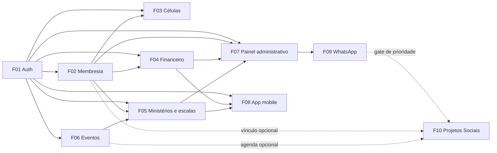

# PRD — Plataforma de Gestão Moriah

**Produto:** Moriah App  
**Igreja:** Igreja Moriah  
**Versão:** v1.2 — Onboarding F11 e catálogo F01–F11
**Data:** 09/10/2026
**Responsável:** Leonardo Furlan  
**Status:** Requisitos anteriores preservados; F10 futura em draft; F11 implementada localmente, sem deploy
**Objetivo:** criar uma plataforma própria para gestão de membresia, contribuições, células, eventos e escalas de ministérios da Igreja Moriah.

---

## 1. Resumo Executivo

A Igreja Moriah precisa reduzir a dependência de WhatsApp, planilhas, fichas físicas e controles manuais para atividades administrativas e ministeriais.

O sistema proposto será uma plataforma interna composta por:

- **Painel web administrativo** para liderança, secretaria, tesouraria e coordenadores.
- **App mobile** para membros, líderes de célula e voluntários.
- **Base única de membresia**, células, ministérios, escalas e contribuições.
- **Fluxo estruturado para envio e validação de comprovantes Pix**.

A primeira versão não deve tentar copiar todos os recursos de soluções como eNuvem. O foco inicial deve ser resolver as dores mais frequentes da Moriah com um MVP simples, utilizável e seguro.

---

## 2. Problema

Hoje, boa parte da gestão da igreja tende a ficar espalhada em canais diferentes:

- Fichas de membros em papel ou planilhas.
- Comprovantes de dízimos e ofertas enviados por WhatsApp.
- Escalas de louvor, dança, recepção, teatro, ministério infantil e técnica montadas manualmente.
- Confirmações de presença perdidas em grupos.
- Informações de células sem histórico organizado.
- Pouca rastreabilidade entre membro, célula, ministério, escala e contribuição.

O problema central não é apenas falta de software. É falta de uma **fonte única de verdade** para a operação da igreja.

---

## 3. Objetivos do Produto

### Objetivo principal

Criar uma plataforma própria da Igreja Moriah para centralizar a gestão de membros, células, contribuições, eventos e escalas ministeriais.

### Objetivos específicos

- Organizar a base de membros e famílias.
- Controlar células, líderes e frequência.
- Permitir que membros enviem comprovantes de dízimos/ofertas pelo app.
- Dar ao tesoureiro um painel de validação dos comprovantes.
- Permitir que o membro consulte seu próprio extrato.
- Organizar escalas de ministérios com confirmação ou recusa.
- Reduzir retrabalho administrativo.
- Criar uma base preparada para módulos futuros: Pix integrado, OCR, Moriah Kids, eventos pagos, Escola Bíblica e notificações.
- Preparar uma área dedicada para projetos sociais, com gestão de beneficiários,
  voluntários, atividades, grade curricular e recursos, após a integração com
  WhatsApp.

---

## 4. Escopo do MVP

O MVP precisa ser menor, direto e funcional. A primeira versão deve validar uso real antes de avançar para automações mais complexas.

### Incluído no MVP

1. **Autenticação e permissões**
   - Login de administradores e membros.
   - Perfis de acesso por função.
   - Separação entre membro, líder, tesoureiro, secretário, coordenador e pastor.

2. **Membresia**
   - Cadastro de membros.
   - Cadastro de famílias.
   - Vínculo entre membros, cônjuge, filhos e responsáveis.
   - Situação: ativo, visitante, inativo, transferido, falecido.
   - Campos básicos: nome, telefone, e-mail, data de nascimento, endereço, estado civil, célula e ministérios.

3. **Células**
   - Cadastro de células.
   - Líderes e auxiliares.
   - Dia, horário e local.
   - Vínculo de membros à célula.
   - Relatório simples de reunião: data, presentes, visitantes e observações.

4. **Financeiro básico**
   - Cadastro de contribuições: dízimo, oferta, campanha e outros.
   - Envio de comprovante pelo membro.
   - Preenchimento manual de valor, data e categoria.
   - Anexo de imagem ou PDF.
   - Status: pendente, validado, recusado.
   - Validação pelo tesoureiro.
   - Extrato individual para o membro.
   - Painel de contribuições para tesouraria.

5. **Escalas de ministérios**
   - Cadastro de ministérios.
   - Cadastro de funções por ministério.
   - Criação de evento/culto.
   - Escala por função.
   - Confirmação ou recusa do membro.
   - Histórico simples de participação.

6. **Painel administrativo web**
   - Usar Django Admin customizado no início.
   - Operação por secretaria, tesouraria e liderança.

7. **App mobile inicial**
   - Login.
   - Perfil do membro.
   - Meu extrato.
   - Enviar comprovante.
   - Minha escala.
   - Confirmar ou recusar escala.

### Fora do MVP

Estes recursos são importantes, mas devem entrar depois:

- OCR automático de comprovante Pix.
- Pix dinâmico por API.
- Pagamento por cartão.
- Conciliação bancária OFX.
- Moriah Kids completo.
- Escola Bíblica completa.
- Eventos pagos.
- Push notifications avançadas.
- Chat interno.
- Ranking de regularidade de dízimos.
- Dashboards pastorais avançados.
- Certificados automáticos.
- Projetos Sociais (F10), incluindo beneficiários, voluntários, turmas,
  atividades, presença, grade curricular, recursos e indicadores.

### Catálogo de features e dependências

O PRD original não possuía IDs de features. A tabela abaixo mapeia o escopo
existente para IDs estáveis sem alterar seu significado e adiciona F10 ao
roadmap. F09 e F10 não fazem parte do MVP atual.

| ID | Feature / resultado | Atores | Prioridade / release | Status | Pré-requisitos obrigatórios | Fornece / consome |
|---|---|---|---|---|---|---|
| F01 | Autenticação e permissões | Admin, pastor, secretaria, tesouraria, coordenação, membro | MVP | Existente no escopo | nenhum | Fornece identidade e capacidades às demais features |
| F02 | Membresia, famílias e perfis | Secretaria, pastor, membro | MVP | Existente no escopo | F01 | Fornece membros e famílias para F03, F04, F05 e F07 |
| F03 | Células e frequência | Líder de célula, secretaria, membro | MVP | Existente no escopo | F01, F02 | Consome F02; fornece reuniões e presença |
| F04 | Financeiro e comprovantes | Membro, tesoureiro, pastor | MVP | Existente no escopo | F01, F02 | Consome F02; fornece extrato e validação |
| F05 | Ministérios e escalas | Coordenador, voluntário/membro, pastor | MVP | Existente no escopo | F01, F02, F06 | Consome membros e eventos; fornece escalas |
| F06 | Eventos e agenda | Secretaria, liderança, membro | MVP | Existente no escopo | F01 | Fornece eventos para F05 e agenda pessoal |
| F07 | Painel administrativo e operação | Secretaria, tesouraria, liderança, coordenadores | MVP | Existente no escopo | F01–F06 conforme o fluxo | Consome e opera os domínios administrativos |
| F08 | App mobile do membro | Membro, líder de célula, voluntário | MVP | Existente no escopo | F01–F06 | Consome perfil, extrato, agenda e escalas |
| F09 | Integração com WhatsApp | Liderança, secretaria, tesouraria, membros | Pós-MVP — prioridade anterior a F10 | Roadmap | F01, F04, F05, F07 | Consome eventos/estados das features e fornece comunicação externa |
| F10 | Projetos Sociais | Coordenador social, responsável de projeto, voluntário, educador, liderança | Pós-F09 — prioridade futura | Draft de requisitos | F01, F02, F06, F07; F09 como gate de prioridade | Fornece gestão social; consome vínculo opcional com membros, agenda e conteúdo |
| F11 | Onboarding pessoal e configuração da igreja | Visitante, frequentador, membro, administrador | Próxima entrega | Implementada localmente; sem deploy | F01, F02, F03, F05, F06, F07, F08 | Consome identidade, vínculo e configurações; fornece acolhida, perfil inicial e progresso |

F09 é uma dependência de sequência do produto para F10, não uma dependência
técnica obrigatória do domínio social. F10 só deve iniciar depois de F09 ser
implementada e validada, conforme a prioridade definida para o Moriah.



---

## 5. Personas e Níveis de Acesso

| Perfil | Necessidade principal | Acesso inicial |
|---|---|---|
| Pastor/Liderança | Visão geral da membresia, células, escalas e relatórios | Web |
| Tesoureiro | Validar comprovantes, lançar contribuições e consultar extratos | Web + App |
| Secretaria | Cadastrar membros, famílias, células e eventos | Web |
| Líder de célula | Registrar reuniões, frequência e visitantes | App |
| Coordenador de ministério | Criar escalas e acompanhar confirmações | Web + App |
| Membro | Consultar extrato, enviar comprovante e ver escala | App |
| Visitante | Cadastro inicial e vínculo futuro | App/Web futuro |
| Coordenador social | Administrar projetos sociais e seus responsáveis | Web |
| Responsável de projeto | Operar um projeto específico, turmas e atividades | Web + App futuro |
| Voluntário/educador | Executar atividades e registrar informações autorizadas | App futuro |
| Beneficiário | Participar de um projeto social; não exige conta no MVP | Sem acesso obrigatório |

---

## 6. Regras de Permissão

### Membro

- Visualiza apenas seus próprios dados básicos.
- Visualiza seu próprio extrato.
- Envia comprovantes.
- Visualiza suas próprias escalas.
- Confirma ou recusa participação.

### Líder de célula

- Visualiza membros da sua célula.
- Registra presença da reunião.
- Registra visitantes.
- Não visualiza dados financeiros dos membros.

### Tesoureiro

- Visualiza contribuições.
- Valida ou recusa comprovantes.
- Edita lançamentos financeiros.
- Exporta relatórios financeiros.
- Não acessa histórico pastoral sigiloso.

### Secretaria

- Cadastra e edita membros, famílias e células.
- Não acessa valores individuais de contribuição, salvo se autorizado.

### Pastor/Admin

- Acesso administrativo amplo.
- Deve ter trilha de auditoria para ações sensíveis.

### Projetos sociais

- Coordenador social administra somente os projetos sociais atribuídos ao seu
  escopo.
- Responsável de projeto gerencia turmas, atividades, presenças e recursos do
  próprio projeto.
- Voluntário ou educador acessa apenas as atividades e os dados mínimos
  necessários para sua atuação.
- Beneficiário não precisa ser membro, usuário ou possuir acesso ao app.
- Dados de beneficiários, responsáveis legais, presenças e observações
  sensíveis não ficam disponíveis automaticamente para secretaria, membros ou
  coordenadores de ministério.
- O vínculo de um beneficiário com um membro, quando existir, deve ser
  explícito e não cria conversão automática de cadastro.

---

## 7. Módulos do Produto

## 7.1 Membresia

### Funcionalidades

- Cadastro completo de membro.
- Cadastro de família.
- Situação do membro.
- Vínculo com célula.
- Vínculo com ministérios.
- Histórico básico de entrada, batismo e transferência.
- Busca e filtros.
- Exportação CSV no painel administrativo.

### Campos sugeridos

- Nome completo.
- Nome social/apelido, se aplicável.
- CPF, opcional no MVP.
- Data de nascimento.
- Telefone.
- E-mail.
- Endereço.
- Estado civil.
- Cônjuge.
- Filhos/responsáveis.
- Célula.
- Ministérios.
- Status.

---

## 7.2 Financeiro

### Funcionalidades do MVP

- Membro envia comprovante.
- Membro informa valor, data, categoria e observação.
- Arquivo fica anexado ao lançamento.
- Tesoureiro valida, recusa ou solicita correção.
- Membro visualiza histórico pessoal.
- Tesouraria visualiza pendências.

### Categorias iniciais

- Dízimo.
- Oferta.
- Campanha.
- Missões.
- Evento.
- Outros.

### Status do lançamento

- `pending`: aguardando validação.
- `approved`: validado pelo tesoureiro.
- `rejected`: recusado.
- `needs_review`: divergência ou dúvida.

### Evolução futura

- OCR para extrair valor, data, nome do pagador e ID da transação.
- Pix dinâmico com webhook.
- Integração com API de pagamentos.
- Conciliação bancária.
- Recibo anual.

---

## 7.3 Células

### Funcionalidades

- Cadastro de célula.
- Líder e auxiliar.
- Endereço, dia e horário.
- Lista de membros.
- Relatório de reunião.
- Registro de presença.
- Registro de visitantes.

### Evolução futura

- Alertas de ausência.
- Dashboard de crescimento.
- Plano de discipulado.
- Integração com Escola Bíblica.

---

## 7.4 Escalas de Ministérios

### Ministérios iniciais

- Louvor.
- Técnica.
- Recepção.
- Moriah Kids.
- Dança.
- Teatro.
- Intercessão.
- Comunicação.

### Funcionalidades

- Cadastro de ministérios.
- Cadastro de funções por ministério.
- Criação de culto/evento.
- Alocação de membro por função.
- Confirmação de escala.
- Recusa com justificativa.
- Status da escala.

### Exemplos de funções

**Louvor:** vocal, guitarra, baixo, bateria, teclado, violão, ministro.  
**Técnica:** som, projeção, mídia, transmissão, iluminação.  
**Recepção:** porta, estacionamento, acolhimento, visitantes.  
**Moriah Kids:** professor, auxiliar, check-in, berçário.  

---

## 7.5 Eventos

No MVP, eventos entram como base para escalas e cultos.

### Funcionalidades iniciais

- Cadastro de culto/evento.
- Data, horário e local.
- Tipo: culto, célula, ensaio, reunião, conferência, evento especial.
- Vinculação com escalas.

### Evolução futura

- Inscrição.
- Pagamento.
- Check-in.
- QR Code.
- Lista de espera.
- Certificados.

---

## 7.6 Projetos Sociais — F10

Esta feature representa uma área dedicada para programas sociais, educativos e
comunitários da igreja. Ela não será modelada como Conteúdo nem como
Ministério. Conteúdo pode ser referenciado por uma aula ou atividade, e um
Ministério pode apoiar o projeto, mas cada domínio preserva sua própria
responsabilidade.

### Prioridade e status

- **Prioridade:** futura, depois da integração com WhatsApp (F09).
- **Release:** pós-F09; fora do MVP atual.
- **Status:** draft de requisitos; os detalhes técnicos estão em
  [`docs/features/F-PS-01-projetos-sociais/spec.md`](docs/features/F-PS-01-projetos-sociais/spec.md).
- **Contrato:** [`docs/features/F-PS-01-projetos-sociais/contract.md`](docs/features/F-PS-01-projetos-sociais/contract.md).
- **Plano:** [`docs/features/F-PS-01-projetos-sociais/plan.md`](docs/features/F-PS-01-projetos-sociais/plan.md).

### Resultado esperado

Permitir que a liderança acompanhe projetos sociais, pessoas atendidas,
equipes voluntárias, atividades, presença, formação e recursos, mantendo
isolamento por igreja e proteção dos dados pessoais.

### Histórias de usuário

- **F10-US01 — Projeto:** como coordenador social, quero cadastrar e acompanhar
  projetos sociais para organizar sua operação e situação.
- **F10-US02 — Beneficiário:** como responsável de projeto, quero cadastrar
  beneficiários mesmo quando eles não são membros da igreja, para acompanhar o
  atendimento sem criar uma membresia artificial.
- **F10-US03 — Voluntário:** como responsável de projeto, quero atribuir
  voluntários internos ou externos a funções e períodos, para organizar a
  equipe.
- **F10-US04 — Turma e atividade:** como responsável de projeto, quero criar
  turmas/ciclos e atividades, para estruturar a execução do projeto.
- **F10-US05 — Presença:** como voluntário autorizado, quero registrar presença,
  ausência ou justificativa, para manter histórico de participação.
- **F10-US06 — Grade curricular:** como educador, quero organizar módulos e
  encontros e referenciar conteúdos existentes, para conduzir a formação.
- **F10-US07 — Recursos:** como responsável de projeto, quero registrar entrada,
  consumo e saldo de recursos, para controlar os materiais utilizados.
- **F10-US08 — Indicadores:** como liderança autorizada, quero consultar
  indicadores básicos de participação e operação, sem expor dados sensíveis
  além do necessário.

### Escopo inicial de F10

- Cadastro e ciclo do projeto: rascunho, ativo, pausado e encerrado.
- Cadastro de beneficiários separado da membresia, com vínculo opcional a um
  membro quando houver correspondência confirmada.
- Cadastro de voluntários internos ou externos, com função e período.
- Turmas, ciclos e inscrições.
- Atividades, responsáveis e controle de presença.
- Grade curricular própria e referência opcional a Conteúdo.
- Recursos operacionais, estoque e movimentações auditáveis.
- Indicadores básicos e relatórios com acesso restrito.
- Auditoria de alterações sensíveis e isolamento por igreja.

### Regras de domínio

- Beneficiário não é sinônimo de membro e não precisa de conta de usuário.
- Voluntário pode ser membro ou pessoa externa.
- A existência de um membro não concede automaticamente acesso à gestão
  social.
- O projeto pode ser apoiado por um Ministério, mas não herda automaticamente
  suas permissões ou escalas.
- Recursos sociais não aparecem no extrato individual de contribuições.
- Encerrar um projeto preserva seu histórico de beneficiários, atividades,
  presença e movimentações, conforme a política de retenção aprovada.
- Dados de menores, responsáveis legais e observações sensíveis exigem política
  específica de consentimento e acesso antes da implementação.

### Dependências

- **F01:** autenticação e capacidades para proteger as operações.
- **F02:** vínculo opcional com membros, sem tornar a membresia obrigatória.
- **F06:** agenda, quando atividades sociais forem exibidas no calendário.
- **F07:** operação administrativa e auditoria.
- **F09:** gate de prioridade do produto; a feature deve iniciar somente após a
  integração com WhatsApp ser concluída e validada.

### Fora do escopo de F10

- Integração com WhatsApp ou notificações externas.
- Portal público de inscrição.
- Prontuário médico ou avaliação clínica.
- Elegibilidade automatizada ou decisão assistencial por IA.
- Contabilidade completa, conciliação bancária e prestação fiscal.
- Conversão automática de beneficiário em membro.

### Critérios de aceite de produto

F10 só poderá ser considerada pronta para implementação quando:

1. O PRD e os documentos técnicos definirem os papéis sociais e seus limites
   de acesso.
2. Houver decisão sobre o tratamento de menores, responsáveis e consentimento.
3. O escopo de recursos estiver definido entre inventário, orçamento, doações e
   prestação financeira.
4. O sistema permitir um fluxo completo de projeto → beneficiário/voluntário →
   turma → atividade → presença, com dados isolados por igreja.
5. A grade curricular puder referenciar conteúdo sem alterar o ciclo editorial
   de Conteúdo.
6. Movimentações de recursos e alterações sensíveis forem auditáveis.
7. A integração WhatsApp (F09) estiver validada antes do início da execução de
   F10.

---

## 8. Stack Recomendada

### Recomendação principal

| Camada | Stack |
|---|---|
| Backend | Django + Django REST Framework |
| Banco de dados | PostgreSQL |
| Painel administrativo | Django Admin customizado |
| App mobile | React Native com Expo + TypeScript |
| Web app futuro | Next.js + TypeScript + Tailwind |
| Autenticação mobile | JWT com djangorestframework-simplejwt |
| Storage de arquivos | S3 compatível: AWS S3, Cloudflare R2 ou MinIO em dev |
| Infra inicial | Docker Compose |
| Deploy inicial | VPS/EC2 com Docker ou PaaS compatível |
| Fila futura | Celery + Redis |
| OCR futuro | Google Cloud Vision API + Tesseract fallback |
| Pagamentos futuro | Efí, Pagar.me ou Mercado Pago |
| Push futuro | Expo Notifications |

### Por que Django

Este projeto é fortemente baseado em cadastros, permissões, painel administrativo, relatórios, anexos, auditoria e workflows internos. Django acelera muito isso porque já entrega:

- ORM maduro.
- Admin pronto.
- Migrations.
- Autenticação.
- Permissões.
- Ecossistema estável.
- Boa produtividade para CRUD administrativo.

### Por que Expo

O app precisa chegar rápido em Android e iOS com uma base só. Expo reduz atrito de build, permite prototipagem rápida e tem bom suporte a câmera, arquivos, notificações e autenticação.

### O que evitar no início

- Microserviços.
- Kubernetes.
- Backend separado para cada módulo.
- OCR obrigatório no primeiro release.
- Pagamentos complexos antes de validar o fluxo manual.
- Painel web customizado antes de explorar o Django Admin.

---

## 9. Arquitetura Inicial

```text
moriah-app/
├── backend/
│   ├── config/
│   ├── apps/
│   │   ├── accounts/
│   │   ├── members/
│   │   ├── cells/
│   │   ├── ministries/
│   │   ├── events/
│   │   ├── schedules/
│   │   ├── finance/
│   │   ├── social_projects/  # futuro — F10, após F09
│   │   └── audit/
│   ├── manage.py
│   ├── requirements.txt
│   └── Dockerfile
├── mobile/
│   ├── app/
│   ├── src/
│   │   ├── screens/
│   │   ├── components/
│   │   ├── services/
│   │   ├── hooks/
│   │   └── types/
│   ├── app.json
│   └── package.json
├── docs/
│   └── PRD_Moriah_App.md
├── docker-compose.yml
├── .env.example
└── README.md
```

---

## 10. Modelo de Dados Inicial

### Entidades principais

- `Church`
- `User`
- `Member`
- `Family`
- `FamilyRelationship`
- `Cell`
- `CellMeeting`
- `CellAttendance`
- `Ministry`
- `MinistryRole`
- `Event`
- `Schedule`
- `ScheduleAssignment`
- `Contribution`
- `ContributionAttachment`
- `AuditLog`

### Entidades futuras previstas para F10

As entidades abaixo são conceitos de produto, não autorização para criar
migrations no MVP. O contrato técnico definitivo pertence aos artefatos de
F10.

- `SocialProject`
- `Beneficiary`
- `BeneficiaryEnrollment`
- `VolunteerProfile` e `ProjectAssignment`
- `ProjectCohort`/`ProjectClass`
- `ProjectActivity` e `Attendance`
- `Curriculum`, `CurriculumModule` e `LessonPlan`
- `ProjectResource` e `ResourceMovement`
- indicadores e relatórios sociais

### Observação importante

Mesmo que o sistema comece apenas para a Igreja Moriah, as tabelas principais devem ter relação com `Church`. Isso deixa o sistema preparado para multi-igreja no futuro sem obrigar uma arquitetura multi-tenant complexa no MVP.

---

## 11. Plano de Desenvolvimento

## Fase 0 — Preparação

**Duração:** 1 semana

### Entregas

- Repositório Git.
- Docker Compose com PostgreSQL e backend.
- Projeto Django criado.
- Projeto Expo criado.
- Padrões de ambiente `.env`.
- README inicial.

---

## Fase 1 — Base do Backend

**Duração:** 1 a 2 semanas

### Entregas

- Models principais.
- Autenticação JWT.
- Perfis e permissões.
- Django Admin configurado.
- API inicial com DRF.
- Seeds de dados para ambiente local.

### Critério de aceite

Um admin consegue criar igreja, usuários, membros, células, ministérios e eventos pelo painel.

---

## Fase 2 — Membresia e Células

**Duração:** 2 semanas

### Entregas

- CRUD de membros.
- CRUD de famílias.
- CRUD de células.
- Vínculo membro-célula.
- Registro simples de reunião de célula.
- Endpoints para app consultar perfil e célula.

### Critério de aceite

Secretaria consegue cadastrar membros e líderes conseguem visualizar sua célula.

---

## Fase 3 — Financeiro Manual com Comprovantes

**Duração:** 2 semanas

### Entregas

- Cadastro de contribuições.
- Upload de comprovante.
- Status de validação.
- Tela/painel de pendências no admin.
- Endpoint para extrato do membro.
- Endpoint para envio de nova contribuição.

### Critério de aceite

Membro envia comprovante pelo app e tesoureiro valida pelo painel.

---

## Fase 4 — App Mobile MVP

**Duração:** 2 semanas

### Entregas

- Login.
- Home simples.
- Perfil.
- Meu extrato.
- Nova contribuição.
- Upload de comprovante.
- Minha célula.

### Critério de aceite

Um membro consegue entrar, ver seus dados, consultar extrato e enviar comprovante.

---

## Fase 5 — Escalas

**Duração:** 2 semanas

### Entregas

- Ministérios e funções.
- Eventos/cultos.
- Escala por função.
- Confirmação/recusa pelo app.
- Painel de acompanhamento no admin.

### Critério de aceite

Coordenador escala voluntários e cada membro confirma ou recusa pelo app.

---

## Fase 6 — Piloto Interno

**Duração:** 2 semanas

### Entregas

- Ajustes de UX.
- Testes com dados reais controlados.
- Correção de bugs.
- Backup.
- Logs.
- Treinamento de secretaria, tesouraria e líderes.

### Critério de aceite

A Moriah consegue rodar um ciclo real com membresia, comprovantes e escalas sem depender exclusivamente do WhatsApp.

---

## 12. Roadmap Pós-MVP

## Fase 2 do Produto

- OCR de comprovante Pix.
- Push notifications.
- QR Pix gerado no app.
- Recibo anual de contribuições.
- Moriah Kids básico.
- Escola Bíblica básica.

## Fase 3 do Produto

- Pix dinâmico com webhook.
- Eventos com inscrição.
- Check-in por QR Code.
- Painéis pastorais.
- Conciliação bancária.
- Pedidos de oração.

## Fase 4 do Produto

- Multi-igreja.
- Planos comerciais.
- Dashboards avançados.
- App público.
- Integração com WhatsApp (F09).

## Fase 5 do Produto — Projetos Sociais

Esta fase só deve começar depois que a integração com WhatsApp (F09) estiver
concluída e validada. A ordem é uma decisão de prioridade do produto; F10 não
deve ser iniciada em paralelo por padrão.

- Cadastro de projetos sociais e responsáveis.
- Cadastro de beneficiários, inclusive pessoas sem vínculo de membresia.
- Cadastro e atribuição de voluntários internos ou externos.
- Turmas, ciclos, atividades e controle de presença.
- Grade curricular e referência opcional a Conteúdo.
- Controle de recursos, estoque e movimentações.
- Indicadores básicos e relatórios com acesso restrito.
- Auditoria e controles de privacidade para dados sensíveis.

---

## 13. Requisitos de Segurança e LGPD

O sistema tratará dados pessoais, religiosos e financeiros. Portanto, a segurança precisa ser considerada desde o início.

### Requisitos mínimos

- HTTPS obrigatório em produção.
- Senhas criptografadas pelo mecanismo padrão do Django.
- Controle de acesso por perfil.
- Auditoria para alterações financeiras.
- Auditoria para alterações de dados de membros.
- Backup automático.
- Política de retenção de comprovantes.
- Consentimento do membro para armazenamento de dados.
- Restrição forte sobre dados financeiros individuais.
- Logs sem exposição de dados sensíveis.

### Atenção especial

Evitar qualquer recurso que gere constrangimento, exposição ou julgamento público sobre contribuições. Dados financeiros individuais devem ser tratados como informação restrita.

---

## 14. KPIs do MVP

| Indicador | Meta inicial |
|---|---|
| Membros cadastrados | 80% da base ativa |
| Contribuições enviadas pelo app | 50% em até 60 dias |
| Comprovantes validados sem WhatsApp | 70% em até 90 dias |
| Escalas confirmadas pelo app | 60% em até 60 dias |
| Líderes de célula usando relatório | 50% em até 90 dias |
| Redução de retrabalho da tesouraria | Evidência qualitativa em 30 dias |

---

## 15. Decisões de Produto

| Tema | Decisão |
|---|---|
| OCR | Não entra no MVP. Fica para evolução. |
| Pagamento no app | Não entra no MVP. Começa com comprovante Pix. |
| Painel web customizado | Não entra no MVP. Começa com Django Admin. |
| App mobile | Entra no MVP com fluxo simples. |
| Multi-igreja | Preparar modelagem, mas não vender como SaaS ainda. |
| Ranking de dízimos | Evitar. Alto risco pastoral e de privacidade. |
| Relatórios pastorais | Começar simples e sem exposição indevida. |

---

## 16. Prompt para Claude Code

Use o prompt abaixo para iniciar o desenvolvimento do projeto.

```text
Você é um engenheiro full-stack sênior. Quero que você desenvolva o MVP de uma plataforma chamada Moriah App, para gestão interna da Igreja Moriah.

Contexto do produto:
A plataforma precisa centralizar membros, famílias, células, ministérios, eventos, escalas e contribuições financeiras com envio de comprovantes Pix. O objetivo do MVP é reduzir o uso de WhatsApp, planilhas e fichas manuais.

Stack obrigatória:
- Backend: Django + Django REST Framework
- Banco: PostgreSQL
- Admin: Django Admin customizado
- Autenticação mobile: JWT com djangorestframework-simplejwt
- Mobile: React Native com Expo + TypeScript
- Infra local: Docker Compose
- Uploads: armazenamento local em desenvolvimento, com camada preparada para S3 no futuro

Não implementar agora:
- OCR automático
- Pix dinâmico
- Pagamento por cartão
- Conciliação bancária
- Chat interno
- Push notifications avançadas
- Next.js

Estrutura desejada do repositório:

moriah-app/
├── backend/
│   ├── config/
│   ├── apps/
│   │   ├── accounts/
│   │   ├── members/
│   │   ├── cells/
│   │   ├── ministries/
│   │   ├── events/
│   │   ├── schedules/
│   │   ├── finance/
│   │   └── audit/
│   ├── manage.py
│   ├── requirements.txt
│   └── Dockerfile
├── mobile/
│   ├── app/
│   ├── src/
│   │   ├── screens/
│   │   ├── components/
│   │   ├── services/
│   │   ├── hooks/
│   │   └── types/
│   ├── app.json
│   └── package.json
├── docker-compose.yml
├── .env.example
└── README.md

Entregue primeiro um esqueleto funcional com:

1. Backend Django
- Projeto Django configurado.
- Apps separados por domínio.
- PostgreSQL via Docker Compose.
- Variáveis de ambiente via .env.
- Django REST Framework configurado.
- SimpleJWT configurado.
- CORS configurado para o app mobile.
- Admin habilitado.

2. Models iniciais
Crie os models abaixo com campos essenciais, timestamps e relacionamento com Church quando fizer sentido:

- Church
- User customizado ou Profile vinculado ao User do Django
- Member
- Family
- FamilyRelationship
- Cell
- CellMeeting
- CellAttendance
- Ministry
- MinistryRole
- Event
- Schedule
- ScheduleAssignment
- Contribution
- ContributionAttachment
- AuditLog

3. Regras básicas
- Um membro pode pertencer a uma célula.
- Um membro pode servir em vários ministérios.
- Um evento pode ter uma ou mais escalas.
- Uma escala possui assignments por função.
- Um assignment pode ter status: pending, confirmed, declined.
- Uma contribuição pode ter status: pending, approved, rejected, needs_review.
- Uma contribuição pode ter um ou mais anexos.
- O membro só pode visualizar o próprio extrato.
- Tesoureiro e admin podem validar contribuições.

4. APIs REST
Crie endpoints para:
- Login JWT.
- Perfil do usuário logado.
- Listar dados do membro logado.
- Listar extrato do membro logado.
- Criar contribuição com upload de comprovante.
- Listar escalas do membro logado.
- Confirmar escala.
- Recusar escala com justificativa.
- Líder de célula listar membros da sua célula.
- Líder de célula registrar reunião e presença.

5. Django Admin
Configure o Django Admin para permitir gestão de:
- Igrejas
- Usuários
- Membros
- Famílias
- Células
- Ministérios
- Funções
- Eventos
- Escalas
- Contribuições
- Anexos

No admin de contribuições, destaque status pendente e permita filtro por status, período, membro e categoria.

6. App Mobile Expo
Crie um app mobile simples com:
- Tela de login.
- Tela inicial.
- Tela Meu Perfil.
- Tela Meu Extrato.
- Tela Nova Contribuição.
- Upload de comprovante por imagem ou documento.
- Tela Minha Escala.
- Ação de confirmar escala.
- Ação de recusar escala com justificativa.

7. Qualidade
- Código organizado.
- Tipagem no mobile.
- Serializers claros no backend.
- Permissões explícitas no DRF.
- README com instruções para rodar tudo localmente.
- .env.example completo.
- Dados seed simples para teste local.

8. Primeiro objetivo técnico
A primeira entrega deve permitir o seguinte fluxo funcionando localmente:

- Admin cria um membro no Django Admin.
- Admin cria uma célula e vincula o membro.
- Admin cria um evento/culto.
- Admin cria uma escala e escala o membro em uma função.
- Membro faz login no app.
- Membro vê sua escala.
- Membro confirma ou recusa.
- Membro envia uma contribuição com comprovante.
- Tesoureiro vê a contribuição pendente no admin.
- Tesoureiro aprova a contribuição.
- Membro visualiza a contribuição aprovada no extrato.

Comece criando a estrutura do projeto, arquivos de configuração e models. Depois implemente APIs e telas mobile. Priorize funcionamento real do fluxo acima antes de qualquer refinamento visual.
```

---

## 17. Handoff para to-specs

Quando F10 for liberada após F09, a especificação técnica deve consumir:

- **Feature:** F10 — Projetos Sociais.
- **PRD:** esta revisão v1.1.
- **Dependências:** F01, F02, F06 e F07; F09 é gate de prioridade e sequência.
- **Provedores/consumidores:** Accounts/Church fornece identidade e escopo;
  Members fornece vínculo opcional; Events fornece agenda opcional; Content
  fornece material opcional; Audit registra operações sensíveis.
- **Artefatos técnicos existentes:**
  [`docs/features/F-PS-01-projetos-sociais/spec.md`](docs/features/F-PS-01-projetos-sociais/spec.md),
  [`contract.md`](docs/features/F-PS-01-projetos-sociais/contract.md) e
  [`plan.md`](docs/features/F-PS-01-projetos-sociais/plan.md), ainda em draft.

A existência deste handoff não autoriza implementação, migration, deploy ou
publicação de tickets. A especificação precisa ser revisada quando as decisões
sobre menores, papéis sociais e escopo financeiro forem confirmadas.

---

## 18. Veredito

O projeto é viável e tem valor real para a Igreja Moriah. O caminho correto é começar pequeno, com foco em três frentes:

1. **Membresia organizada.**
2. **Comprovantes financeiros fora do WhatsApp.**
3. **Escalas confirmadas pelo app.**

Depois disso, a plataforma pode evoluir para OCR, Pix integrado, Moriah Kids, Escola Bíblica, eventos e dashboards.

A stack recomendada para começar é:

> **Django + Django REST Framework + PostgreSQL + Expo React Native + Django Admin.**

## 19. F11 — Onboarding pessoal e configuração da igreja

Requisitos aprovados em 09/10/2026. [Registro de decisões](docs/decisoes-onboarding-2026-10-09.md).
[Especificação](docs/features/F11-onboarding/spec.md),
[contrato proposto](docs/features/F11-onboarding/contract.md),
[plano](docs/features/F11-onboarding/plan.md).
Implementada localmente, sem deploy. Primeira entrega exclusiva da Igreja Moriah.

### Problema e resultado

O cadastro por WhatsApp já existe, mas falta acolhida, preenchimento guiado do
perfil e orientação para configurar a igreja. A entrega deve acolher pessoas,
identificar sua relação com a comunidade e mostrar aos administradores o que
falta configurar. Hoje há apenas a conta admin, segundo o responsável pelo produto;
essa informação não foi auditada em produção nesta definição.

### Histórias e critérios de aceite

- **F11.1 — Acolhida e perfil:** como visitante, frequentador, membro ou admin,
  quero uma acolhida breve e conferir meus dados para começar a usar o sistema.
  Nome, e-mail, WhatsApp verificado, data de nascimento e relação com a igreja
  são essenciais. Data de nascimento é obrigatória para mapear perfil etário;
  foto, endereço e família ficam para depois. Reaproveitar dados existentes e
  WhatsApp vinculado, inclusive o da conta admin. Apresentação pulável; perfil
  obrigatório antes das demais telas, preservando onboarding e saída. Progresso
  individual salvo e retomável. Admin sem Member deve concluir normalmente.
- **F11.2 — Relação e conferência:** como usuário, quero informar “Estou
  conhecendo a igreja”, “Já frequento, mas ainda não sou membro” ou “Já sou
  membro”. A última resposta envia solicitação automática à secretaria na
  conclusão, sem duplicar pendência nem refazer vínculo confirmado. Não concede
  cargo, permissão ou membresia automaticamente; revisão continua humana.
- **F11.3 — Próximos passos:** quem conhece a igreja vê cultos/eventos;
  frequentadores veem também como participar de célula; membros autodeclarados
  veem situação da conferência e atalhos autorizados. Grade semanal de cultos
  própria, com dia, horário e local, também atende visitantes. Ausência de
  registros deve gerar orientação, sem destinos indisponíveis.
- **F11.4 — Configuração guiada:** como administrador, quero checklist e
  percentual compartilhados pela igreja. Seis itens: revisar dados da igreja,
  conferir equipe/permissões, cadastrar horários de cultos, publicar primeiro
  evento, cadastrar primeira célula e primeiro ministério. Os dois primeiros
  exigem confirmação; os demais são detectados nos cadastros atuais. Peso igual,
  percentual concluídos/6×100; todos aplicáveis, sem “Não se aplica”.
  Configurações prontas contam e remoção da condição faz o item voltar a pendente.
- **F11.5 — Acompanhamento:** card no painel com percentual, pendências e
  “Continuar configuração”, dispensável a 100%. Abaixo de 100% reaparece
  automaticamente. Checklist sempre disponível nas configurações, sem bloquear
  painel após conclusão pessoal. Acolhida e orientações pessoais são individuais.

### Dependências, entrega e validação

F01 → F11 fornece sessão, identidade e permissões. F02 → F11 fornece perfil
oficial e revisão de vínculo. F03/F05/F06 → F11 fornecem células, ministérios e
eventos; F06 recebe extensão coordenada da grade semanal. F07/F08 → F11 fornecem
shells de gestão/app; consomem o estado F11 sem criar dependência circular de
suas funcionalidades existentes. F09 completo e F10 não são pré-requisitos.

Onda 1: perfil obrigatório e retomada; onda 2: conferência e grade semanal com
próximos passos; onda 3: checklist e card; aceite integrado em seguida.
Essa ordem é de implementação, sem autorização para agentes paralelos.

Aceite por APIs reais em banco isolado e jornada desktop/celular, incluindo
admin sem Member, visitante com Member, concorrência/deduplicação, outra igreja,
rotas diretas, perfil incompleto, remoção de configurações e reaparecimento do
card. Critérios técnicos e gates estão na spec; nenhuma meta numérica de adoção
ou performance foi acordada. Evidências da implementação e testes no
[relatório F11](docs/relatorio-implementacao-onboarding-2026-10-09.md).

### Evolução futura e limites

Futuras solicitações obrigatórias de atualização cadastral deverão reutilizar
onboarding para exigir os campos necessários, preservando dados e vínculos.
Campanhas, seleção de público, exceções e política de bloqueio dessa evolução
ficam para especificação futura. Não inclui novas igrejas, marketing, aprovação
automática de membros ou permissão para migrar, publicar ou fazer deploy.
