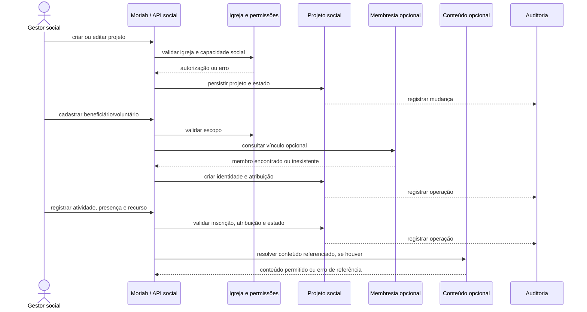

# F-PS-01 — Projetos Sociais

Status: **draft exploratório — não pronto para implementação**  
ID da feature: **F10 — Projetos Sociais**  
Diretório legado dos artefatos: `F-PS-01-projetos-sociais`  
PRD canônico: [`PRD_Moriah_App_v1.md`](../../../PRD_Moriah_App_v1.md), v1.1, setembro/2026  
Artefatos relacionados: [`contract.md`](contract.md) · [`plan.md`](plan.md)  
Glossário: [`CONTEXT.md`](../../../CONTEXT.md)

## 1. Escopo e evidências

### Intenção

Adicionar ao Moriah uma área dedicada para gestão de projetos sociais da
igreja, cobrindo beneficiários, voluntários, turmas ou ciclos, atividades,
presença, grade curricular, recursos e indicadores básicos.

### Evidência existente

- O PRD define como objetivo central uma plataforma interna para membresia,
  células, ministérios, eventos, escalas e contribuições
  ([PRD, seção 3](../../../PRD_Moriah_App_v1.md#3-objetivos-do-produto)).
- O PRD cita Escola Bíblica e Moriah Kids como evolução futura
  ([PRD, seção 12](../../../PRD_Moriah_App_v1.md#12-roadmap-pós-mvp)) e agora
  cataloga Projetos Sociais como F10, posterior à integração com WhatsApp F09.
- O backend já possui separação por domínio em `backend/apps/`, com módulos de
  contas, membros, ministérios, eventos, conteúdo, escalas e auditoria.
- `members.Member` representa membresia da igreja e não deve ser usado como
  identidade obrigatória de beneficiários externos.
- `ministries.Ministry` representa equipe interna e possui membros,
  coordenadores e funções; sua semântica não cobre atendimento social.
- `content.Content` representa publicação editorial com rascunho/publicação;
  deve ser referenciável, não usado como registro de aula ou atendimento.
- Os gates configurados no CI são pytest, geração do schema OpenAPI, Django
  check e typecheck do mobile. Eles foram inventariados, mas não foram
  executados nesta geração de documentos.

### Proposta

Criar um domínio próprio, proposto como `backend/apps/social_projects/`, com
integrações opcionais aos domínios existentes. O caminho de UI proposto é
**Projetos Sociais**, possivelmente agrupado no menu como **Missão e Impacto**.

### Fora do escopo desta feature

- Integração com WhatsApp, envio de mensagens ou notificações externas.
- Portal público para inscrição de beneficiários.
- Prontuário médico, assistência social clínica ou avaliação diagnóstica.
- Contabilidade completa, conciliação bancária ou prestação fiscal do projeto.
- Automação de decisões sobre elegibilidade ou prioridade de atendimento.
- Transformar beneficiários em membros automaticamente.
- Substituir Ministérios, Conteúdo, Agenda ou Financeiro existentes.

## 2. Requisitos comportamentais

Os requisitos abaixo são propostas de especificação e permanecem sujeitos à
aprovação no PRD.

### PS-BR-01 — Cadastro e ciclo do projeto

O sistema deve permitir que uma pessoa autorizada crie um projeto pertencente
à sua igreja, com nome, objetivo, descrição, responsável, período opcional e
estado operacional. Um projeto deve possuir estados `draft`, `active`,
`paused` e `closed`; apenas projetos `active` podem receber novas inscrições e
atividades operacionais. O histórico de mudança de estado deve ser auditável.

### PS-BR-02 — Beneficiário separado de membro

O sistema deve permitir cadastrar um beneficiário sem conta de usuário e sem
vínculo com `members.Member`. Quando houver correspondência com um membro, o
vínculo deve ser explícito e opcional. A mesma pessoa não pode ser duplicada
silenciosamente por uma tentativa de cadastro equivalente; o fluxo deve
permitir revisão humana quando a identidade for incerta.

### PS-BR-03 — Voluntários internos e externos

O sistema deve permitir atribuir ao projeto uma pessoa voluntária interna,
ligada a um membro, ou externa, com cadastro operacional mínimo. Cada atribuição
deve indicar função, período de validade e estado. A remoção da atribuição não
pode apagar o histórico de atividades ou presenças já registradas.

### PS-BR-04 — Turmas, ciclos e inscrições

Um projeto pode organizar beneficiários em turmas ou ciclos. Uma inscrição deve
ter projeto, beneficiário, estado, data de entrada e, quando aplicável, data de
saída e motivo. O beneficiário pode participar de mais de um projeto, mas não
deve haver duas inscrições ativas equivalentes na mesma turma.

### PS-BR-05 — Atividades e presença

O sistema deve permitir registrar uma atividade vinculada ao projeto e,
opcionalmente, a uma turma, local, horário, responsável e conteúdo aplicado.
Para cada atividade, o operador autorizado deve registrar presença, ausência ou
justificativa dos beneficiários inscritos e a participação dos voluntários
atribuídos. O registro deve preservar quem lançou ou alterou a informação.

### PS-BR-06 — Grade curricular

O projeto deve poder possuir uma grade curricular própria, com módulos,
encontros ou etapas ordenadas. Uma aula pode referenciar um `Content` existente,
mas a publicação, o texto e o status editorial do conteúdo continuam sob a
responsabilidade do domínio Conteúdo. Alterar ou retirar um conteúdo não deve
apagar o histórico da atividade em que ele foi usado.

### PS-BR-07 — Recursos operacionais

O sistema deve permitir cadastrar recursos controlados pelo projeto, incluindo
tipo, unidade, quantidade disponível e localização quando aplicável. O consumo,
entrada, ajuste ou transferência deve gerar movimentação auditável. Valores
financeiros do recurso não devem aparecer no extrato individual de membros.

### PS-BR-08 — Permissões por capacidade e escopo

O acesso deve ser concedido por capacidade social e pelo escopo do projeto:

- administrador/pastor: acesso amplo conforme a política da igreja;
- coordenador social: gerencia projetos aos quais foi atribuído;
- responsável do projeto: gerencia operação do próprio projeto;
- voluntário/professor: acessa apenas suas atividades e os dados mínimos
  necessários para executá-las;
- secretaria: não recebe automaticamente acesso a dados sociais sensíveis;
- membro comum: não recebe acesso administrativo só por ser membro.

Beneficiários, responsáveis legais, observações sensíveis e presenças devem
ser tratados como dados restritos. A autorização administrativa existente não
deve ser presumida como autorização de membro ou de voluntário.

### PS-BR-09 — Isolamento por igreja

Toda consulta, alteração, relatório, relacionamento e movimento de recurso deve
ser filtrado pela igreja do usuário e pelo escopo social autorizado. Um usuário
de uma igreja não pode observar nem inferir dados de outra igreja por IDs,
filtros, contagens ou relatórios.

### PS-BR-10 — Auditoria e retenção histórica

Criação, alteração de estado, inscrição, atribuição de voluntário, lançamento de
presença, alteração de dado sensível e movimentação de recurso devem deixar
trilha com ator, horário, igreja, objeto e alteração relevante. Encerrar um
projeto deve preservar o histórico operacional.

## 3. Decisões técnicas propostas

### DT-01 — Domínio próprio

**Escolha proposta:** módulo `social_projects`, em vez de estender
`ministries` ou `content`.

**Motivo:** os limites de identidade, autorização, ciclo de vida e LGPD são
distintos. Reutilizar apenas as integrações necessárias reduz duplicação sem
misturar semânticas.

**Alternativas rejeitadas:**

- ampliar `ministries.Ministry` para representar projetos: mistura equipes
  internas, escalas e atendimento social;
- representar aulas e beneficiários como `content.Content`: perde presença,
  inscrição, responsabilidade e histórico operacional.

Status: proposta, aguardando confirmação no PRD.

### DT-02 — Identidade externa

**Escolha proposta:** beneficiário e voluntário externo possuem identidade
operacional própria; vínculos com `Member` e `User` são opcionais.

Isso preserva a semântica atual de `members.Member` e evita exigir conta para
quem só é atendido ou participa de uma atividade.

Status: proposta, aguardando decisão sobre público inicial e menores.

### DT-03 — Financeiro social separado

**Escolha proposta:** iniciar com estoque/movimentação de recursos e orçamento
operacional simples, sem reutilizar o extrato de contribuições dos membros.

Doações ou lançamentos financeiros específicos podem ser tratados em uma
subfeature posterior, com contrato próprio e integração explícita ao Financeiro.

Status: proposta, aguardando confirmação do nível de controle financeiro.

## 4. Fluxo principal

## 5. Casos de borda nomeados

| Caso | Precondições / ação | Resultado esperado | Verificação |
| --- | --- | --- | --- |
| PS-EC-01 Beneficiário sem membro | Cadastro não possui usuário nem `Member` | Cadastro aceito como beneficiário externo; nenhuma conta é criada | PS-BR-02 |
| PS-EC-02 Correspondência incerta | Nome/telefone parecem coincidir com membro | Sistema não vincula automaticamente; exige escolha/revisão | PS-BR-02 |
| PS-EC-03 Menor com responsável | Beneficiário é menor e requer responsável | Cadastro só fica operacional com política de responsável/consentimento aprovada | Decisão D-02; bloqueador |
| PS-EC-04 Voluntário removido | Atribuição termina após atividades registradas | Novas atividades são bloqueadas para a atribuição; histórico permanece | PS-BR-03 |
| PS-EC-05 Projeto pausado | Projeto está `paused` | Novas inscrições e atividades operacionais são rejeitadas; leitura autorizada permanece | PS-BR-01 |
| PS-EC-06 Presença duplicada | Dois lançamentos concorrentes para a mesma pessoa/atividade | Uma presença vigente; segunda operação é rejeitada ou vira atualização auditada | PS-BR-05 |
| PS-EC-07 Recurso insuficiente | Consumo excede saldo disponível | Operação rejeitada sem saldo negativo, salvo regra aprovada de ajuste | PS-BR-07; decisão D-03 |
| PS-EC-08 Igreja diferente | ID válido pertence a outra igreja | Resposta indistinguível de recurso inexistente, sem vazamento de dados | PS-BR-09 |
| PS-EC-09 WhatsApp indisponível | Projeto operando antes da integração futura | Operação social não depende de WhatsApp nem fica bloqueada por sua indisponibilidade | Fora de escopo |
| PS-EC-10 Conteúdo arquivado | Atividade aponta para conteúdo que deixou de ser publicado | Histórico preserva a referência; nova aplicação exige política definida | PS-BR-06 |

## 6. Estratégia de regressão e aceitação

Esta matriz é proposta; nenhum teste foi executado porque a feature ainda não
foi implementada.

| Requisito | Seam público | Evidência de aprovação |
| --- | --- | --- |
| PS-BR-01 | API/admin de projetos | Estados válidos, transições proibidas e auditoria verificadas |
| PS-BR-02 | Cadastro e consulta de beneficiário | Externo aceito, vínculo explícito e isolamento verificados |
| PS-BR-03 | Atribuição de voluntário | Interno/externo, validade e histórico verificados |
| PS-BR-04 | Inscrição em turma/ciclo | Unicidade ativa e encerramento verificados |
| PS-BR-05 | Atividade/presença | Presença idempotente, escopo e histórico verificados |
| PS-BR-06 | Grade/conteúdo | Referência opcional não altera ciclo editorial |
| PS-BR-07 | Recurso/movimentação | Saldo, concorrência e auditoria verificados |
| PS-BR-08/09 | Usuários com capacidades distintas | Matriz positiva e negativa por igreja/projeto |
| PS-BR-10 | Auditoria | Eventos sensíveis possuem ator, objeto e payload verificáveis |

## 7. Qualidade e prontidão

| Gate | Evidência de configuração | Comando e cwd | Política | Execução |
| --- | --- | --- | --- | --- |
| Backend tests | `backend/pytest.ini`, CI | `python -m pytest -q` em `backend/` | Existente e obrigatório | Não executado |
| API schema | `.github/workflows/ci.yml` | `$env:DJANGO_SETTINGS_MODULE='config.settings_test'; python manage.py spectacular --file /dev/null` em `backend/` | Existente e obrigatório | Não executado |
| Django check | `.github/workflows/ci.yml` | `$env:DJANGO_SETTINGS_MODULE='config.settings_test'; python manage.py check` em `backend/` | Existente e obrigatório | Não executado |
| Mobile typecheck | `mobile/package.json`, CI | `npm run typecheck` em `mobile/` | Existente e obrigatório quando houver mobile | Não executado |
| Patch hygiene | prática do repositório | `git diff --check` na raiz | Obrigatório antes de implementação | Não executado |

Não existe neste repositório um validador arquitetural específico para
confirmar limites entre apps; sua criação é uma lacuna proposta, não um gate
existente.

## 8. Pendências bloqueadoras

1. Confirmar se o modelo inicial deve suportar vários projetos desde o começo
   ou apenas um projeto social piloto.
2. Confirmar se menores e responsáveis legais fazem parte do primeiro escopo.
3. Confirmar se recursos incluem apenas inventário/consumo ou também orçamento,
   doações e prestação financeira.
4. Confirmar papéis sociais e quem pode acessar dados sensíveis.
5. Confirmar a política de precedência: WhatsApp deve estar concluído antes da
   implementação social, mas não precisa ser dependência técnica do domínio.

Enquanto essas decisões não forem aprovadas, esta especificação não está pronta
para tickets de implementação.
