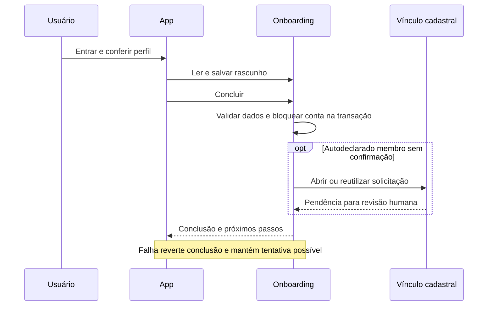

# F11 — Onboarding pessoal e configuração da igreja

Revisão 1, 09/10/2026. **Implementação local, sem deploy**;
decisões de produto D01 e D02 confirmadas. Desenho aplicado após autorização.
Fonte canônica: [PRD v1.2](../../../PRD_Moriah_App_v1.md), seção F11.
[Contrato](contract.md) · [Plano](plan.md) · [Divisão proposta](tickets-propostos.md).
As jornadas, divisão e implementação foram aprovadas pelo produto. O desenho foi
aplicado; resultados atuais estão no [relatório](../../relatorio-implementacao-onboarding-2026-10-09.md).

## Evidência e escopo

Inspeção local, sem consultar produção:

- `backend/apps/accounts/models.py`: Church, User, papéis compostos e
  WhatsAppIdentity. Administrador pode não possuir Member; User não tem nascimento.
- `backend/apps/members/models.py`: Member possui birth_date e status; solicitação
  de vínculo é entidade distinta. Perfil visitante vinculado a User não comprova
  membresia confirmada.
- `backend/apps/members/linking.py`: open_request é transacional, deduplica
  pendências e notifica revisores, mas rejeita qualquer conta que já possua Member.
  Esse comportamento requer adaptação coordenada para visitantes autodeclarados membros.
- `backend/apps/accounts/permissions.py`: capacidades e is_admin_user existentes.
- `backend/apps/events/models.py`: Event tem active e start_at, sem status
  “publicado” nem grade semanal. EventAnnouncement é folder, não publicação do evento.
- `backend/apps/cells/models.py` e `ministries/models.py`: entidades já existentes.
- `mobile/app/_layout.tsx`: guardas atuais de sessão, capacidades e vínculo.
- `mobile/src/components/WhatsAppAccess.tsx`: registro inicial já pede nome/e-mail.
- `mobile/src/screens/ProfileScreen.tsx`: vínculo e alterações cadastrais revisáveis.
- `mobile/src/screens/HomeScreen.tsx`: ponto de integração do card.

Inclui a jornada pessoal, retomada, checklist administrativo e próximos passos.
Exclui cadastro de novas igrejas, campanhas futuras de atualização obrigatória,
atribuição automática de papéis, marketing e criação automática de membro confirmado.
F09 completo não é pré-requisito: reutiliza-se o acesso WhatsApp já implementado.

## Comportamento verificável

| ID | Pré-condição / ação | Resultado esperado |
| --- | --- | --- |
| R01 | Primeiro acesso autenticado | Acolhida breve; apresentação pulável; perfil essencial obrigatório para concluir |
| R02 | Conferir perfil | Nome, e-mail e identidade WhatsApp reaproveitados; nascimento e relação com a igreja exigidos; dados preenchidos permanecem |
| R03 | Interromper e entrar em outro dispositivo | Retomar o último passo salvo no servidor, da mesma conta |
| R04 | Concluir como membro autodeclarado | Abrir uma solicitação de conferência; reutilizar pendente; preservar vínculo confirmado; nenhuma permissão nova |
| R05 | Concluir demais relações | Não abrir solicitação de vínculo; mostrar destinos aprovados no PRD |
| R06 | Administrador sem Member | Completar perfil pessoal sem criar Member artificial; WhatsApp vinculado não requer outro OTP |
| R07 | Consultar checklist | Seis itens iguais; percentual inteiro arredondado a partir de concluídos/6; sequência 0,17,33,50,67,83,100 |
| R08 | Confirmar revisões da igreja/equipe | Confirmações compartilhadas, atribuídas ao administrador autenticado; repetição não duplica efeitos |
| R09 | Criar/remover registro necessário | Recalcular itens automáticos e percentual na próxima leitura; dados existentes contam |
| R10 | Dispensar card a 100%; depois remover configuração | Dispensar por usuário; reaparecer abaixo de 100%; checklist sempre acessível nas configurações |
| R11 | Outra conta/igreja ou usuário sem permissão | Nenhuma leitura ou alteração administrativa indevida, mesmo por URL/API direta |
| R12 | Falha de conclusão/vínculo | Não marcar onboarding concluído parcialmente; permitir tentativa posterior sem duplicatas |

## Casos de borda e aceitação

| Caso | Entrada / situação | Resultado observável / evidência |
| --- | --- | --- |
| E01 | Nascimento vazio, inválido ou futuro | 400 no campo; perfil não concluído; R02 |
| E02 | Relação fora do enum, nome vazio, e-mail inválido | 400; nenhum papel ou vínculo modificado; R02/R11 |
| E03 | Duas conclusões simultâneas ou resposta perdida | Uma conclusão e no máximo uma solicitação pendente; teste PostgreSQL; R04/R12 |
| E04 | Conta já vinculada a visitante | Solicitação revisável sem tomar cadastro alheio ou tratar visitante como membro confirmado; R04 |
| E05 | Vínculo confirmado ou solicitação pendente | Preservar/reutilizar; nunca duplicar; R04 |
| E06 | Sem candidatos ou sem revisor disponível | Criar pendência válida; sem aprovação automática; preservar comportamento de alerta existente; R04 |
| E07 | Admin sem Member, com WhatsApp vinculado | R06 funciona sem HasMemberProfile e sem OTP adicional |
| E08 | Igreja ausente / ID de outra igreja no corpo | 403 sem igreja; IDs enviados rejeitados; nenhuma informação externa; R11 |
| E09 | Zero e seis itens concluídos | 0% e 100%; contagem inteira de 0 a 6; R07 |
| E10 | Card dispensado e progresso cai e volta a 100% | Queda invalida dispensa anterior; permanece visível até nova dispensa; R09/R10 |
| E11 | Atualização de nascimento difere do Member oficial | Não sobrescrever cadastro oficial sem revisão; informar pendência de alteração; R02 |
| E12 | Sessão expira, rede falha, voltar/recarregar | Login preserva progresso; erro permite retentar; guardas sem loop; R03/R12 |
| E13 | Não há cultos/eventos/células | Estado vazio com orientação, sem link para módulo indisponível; R05 |
| E14 | Remover última célula/ministério ou desativar último evento | Respectivo item pendente na próxima consulta; R09 |

Datas aceitam qualquer data civil válida até hoje; não se inventa idade mínima.
Valores negativos/zero não se aplicam a nascimento e enum; IDs e contagens seguem
o contrato. Não há fila externa nova: consistência de conclusão é transacional.

## Decisões técnicas propostas

- **D01 aprovada:** grade semanal própria com dia, horário e local, exibida aos
  visitantes. Estender events com persistência e editor, sem gerar eventos avulsos.
- **D02 aprovada:** perfil pessoal concluído antes das demais telas, inclusive
  para admin. Guardas no backend e UI, com exceções exatas no contrato. Checklist
  da igreja nunca bloqueia o painel após a conclusão pessoal.
- Persistir estado pessoal em accounts, separado do Member; nascimento informado
  no onboarding pertence à conta, e Member continua dono do cadastro oficial.
  Se diferente, integrar MemberUpdateRequest sem aprovação automática. No vínculo,
  preservar nascimento informado e não substituir nascimento oficial por esse dado.
- Persistir confirmações da igreja e dispensas individuais; calcular itens de
  configuração pelos dados atuais da mesma igreja. Não confiar em flags do cliente.
- Serializar conclusão e abertura/revisão de vínculo pelo lock de User já usado.
  Ajustar serviço compartilhado, incluindo notificação e auditoria, com regressões
  da aprovação que troca perfil visitante por cadastro confirmado, sem perda de
  dependências existentes. Essa integração deve preservar o contrato de revisão.
- Checklist completo exclusivo de is_admin_user com church_id; outras capacidades
  não concedem gestão global. Usar Admin existente quando não houver editor no app,
  respeitando is_staff e escopo; não criar link que contorne autorização.
- Considerar Event.active=true como “publicado” nesta entrega (proposta de
  compatibilidade, sem criar novo workflow editorial). Evento passado ativo conta
  como configuração; lista de próximos eventos continua filtrada pela agenda.
- Primeira migração aditiva e sem concluir contas automaticamente; preencher
  rascunho a partir de dados existentes. Migração não cria igreja nem identidades.
  Rollback de código mantém campos aditivos; remoção de dados só em plano aprovado.

## Verificação e gates

Todos R01–R12 e E01–E14 devem ser demonstrados por APIs autenticadas e jornada
real desktop/celular; E03 requer PostgreSQL, não apenas SQLite. Testes de vínculo
existentes são controles positivos para revisão e negativos para apropriação.
Verificar sessão por WhatsApp e senha, admin sem Member, outra igreja e deep links.
Mocks de envio são permitidos em ambiente isolado; não comprovam entrega real.

| Gate | Fonte | Comando e diretório | Política / estado nesta especificação |
| --- | --- | --- | --- |
| Backend | .github/workflows/ci.yml; backend/pytest.ini | `python -m pytest -q` em backend | Existente; não executado (documentação) |
| Schema | CI | `python manage.py spectacular --file schema-f11.yml` em backend, settings_test | Existente, saída local adaptada; não executado |
| Django | CI | `python manage.py check` em backend, settings_test | Existente; não executado |
| TypeScript | mobile/package.json | `npm run typecheck` em mobile | Existente; não executado |
| Regressões mobile | mobile/package.json | `npm test` em mobile | Existente; não executado |
| Bundle web | CI | `npx expo export --platform web --output-dir dist` em mobile | Existente; não executado |
| Concorrência real | settings_test_postgres, testes de vínculo existentes | `python -m pytest apps/accounts/tests apps/members/tests -q --ds=config.settings_test_postgres` em backend | Gate ampliado proposto; banco PostgreSQL isolado; não executado |
| QA desktop/mobile | tools/qa/scripts/whatsapp-onboarding.mjs | Novo cenário F11 a definir junto à implementação | Proposto; não executado |
| Integridade textual | Git | `git diff --check` na raiz | Executado na preparação dos documentos |

Dependências Python/Node instaladas e banco de teste descartável são pré-requisitos
dos gates de execução. Não instalar nem acessar produção para validar documentação.
Fixtures novas devem ser sintéticas e conter outra igreja como controle negativo.

## Prontidão

Produto e implementação aprovados, incluindo D01/D02. Publicação usa Event.active,
armazenamento pessoal separado e guardas no backend/app. A tabela de gates acima
preserva o planejamento original; resultados atuais no relatório prevalecem sobre
“não executado”. Migrações ensaiadas apenas em bases descartáveis.
Sem commit, push, publicação externa ou deploy.
