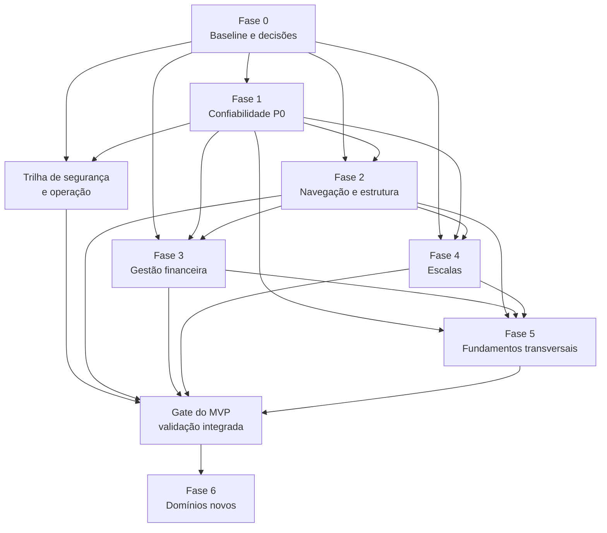

# Grafo de dependências do MVP — App Moriah

**Data:** 16/09/2026  
**Status:** Proposto  
**Documento relacionado:** [Plano de execução do MVP](C:/Projetos%20TI/moriah_app/docs/plano-mvp-moriah-execucao-2026-09-16.md)

## Grafo



## Leitura

- A Fase 0 é a raiz do plano. Sem escopo, capacidades e regras de dados, as demais fases podem implementar fluxos incompatíveis.
- A Fase 1 precede a expansão da navegação porque operações de escrita e erros precisam ser visíveis antes de multiplicar rotas.
- As Fases 3 e 4 podem ocorrer em paralelo depois que as Fases 0–2 definirem capacidade, tratamento de erro e navegação.
- A Fase 5 espera financeiro e escalas porque seus filtros, paginação e notificações devem atender aos fluxos reais do MVP.
- A trilha de segurança e operação corre em paralelo, mas bloqueia o gate quando envolver autenticação, tenant, auditoria ou exposição de dados.
- A Fase 6 começa somente depois do gate do MVP e exige modelagem própria para cada novo domínio.

## Dependências por fase

| Fase | Depende de | Pode ocorrer em paralelo com | Bloqueia |
|---|---|---|---|
| Fase 0 — Baseline | Nenhuma | — | Todas as fases de produto |
| Fase 1 — Confiabilidade | Fase 0 | Trilha de segurança | Fase 2 e fluxos confiáveis |
| Fase 2 — Navegação | Fases 0 e 1 | Preparação de contratos de F3/F4 | Fases 3 e 4 |
| Fase 3 — Financeiro | Fases 0, 1 e 2 | Fase 4 | Fase 5 e gate do MVP |
| Fase 4 — Escalas | Fases 0, 1 e 2 | Fase 3 | Fase 5 e gate do MVP |
| Fase 5 — Transversal | Fases 1, 2, 3 e 4 | Ajustes finais da trilha de segurança | Gate do MVP |
| Segurança e operação | Fase 0; usa correções da Fase 1 | Fases 2, 3, 4 e 5 | Gate do MVP, quando aplicável |
| Gate do MVP | Fases 2, 3, 4, 5 e segurança aplicável | — | Fase 6 |
| Fase 6 — Domínios novos | Gate do MVP + contrato do domínio | — | Expansão de cada domínio |

## Caminho crítico

```text
Fase 0 → Fase 1 → Fase 2 → (Fase 3 e Fase 4) → Fase 5 → Gate do MVP
```

As Fases 3 e 4 são paralelizáveis, mas a Fase 5 só deve ser fechada depois que ambas tiverem contratos e fluxos reais para consumir. A trilha de segurança acompanha o caminho e pode bloquear o gate mesmo quando as telas estiverem prontas.

## Gates de passagem

### Gate 0 — Baseline aprovado

- escopo do MVP registrado;
- matriz de capacidades aprovada;
- seed e ambiente de QA identificados;
- decisões de tenant e estados de negócio documentadas.

### Gate 1 — Confiabilidade aprovada

- erros e sucessos visíveis no web;
- operações de escrita sem duplicação;
- guards de rota funcionando;
- dashboard sem números fictícios não identificados.

### Gate 2 — Navegação aprovada

- nenhum item visível aponta para tela errada;
- sidebar e tabs usam a mesma fonte;
- rotas inválidas têm fallback em PT-BR.

### Gate 3 — Fluxos de negócio aprovados

- aprovação de contribuição validada;
- criação, publicação e resposta de escala validadas;
- permissões e escopo de tenant testados.

### Gate 4 — MVP liberável

- Fases 2–5 concluídas;
- trilha de segurança aplicável concluída;
- QA desktop/mobile reproduzido;
- evidências anexadas;
- nenhuma promoção para produção sem autorização explícita.
